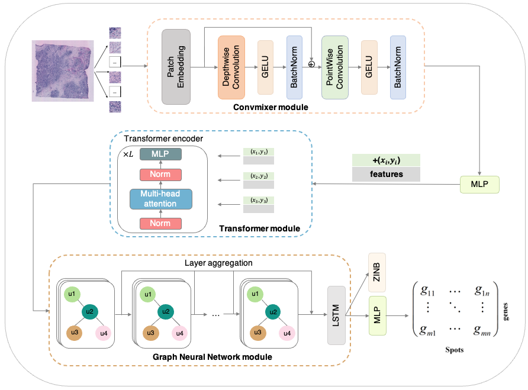

# Spatial Transcriptomics Prediction from Histology jointly through Transformer and Graph Neural Networks
### Yuansong Zeng, Zhuoyi Wei, Weijiang Yu, Rui Yin,  Bingling Li, Zhonghui Tang, Yutong Lu, Yuedong Yang*


 Here, we have developed Hist2ST, a deep learning-based model using histology images to predict RNA-seq expression.
  At each sequenced spot, the corre-sponding histology image is cropped into an image patch, from which 2D vision 
  features are learned through convolutional operations. Meanwhile, the spatial relations with the whole image and
   neighbored patches are captured through Transformer and graph neural network modules, respectively. These learned
    features are then used to predict the gene expression by following the zero-inflated negative binomial (ZINB) distribution.
     To alleviate the impact by the small spatial transcriptomics data, a self-distillation mechanism is employed for efficient
      learning of the model. Hist2ST was tested on the HER2-positive breast cancer and the cutaneous squamous cell carcinoma datasets, 
      and shown to outperform existing methods in terms of both gene expression prediction and following spatial region identification.
       





# Usage
```python
import torch
from HIST2ST import Hist2ST

model = Hist2ST(
    depth1=2, depth2=8, depth3=4,
    n_genes=785, learning_rate=1e-5,
    kernel_size=5, patch_size=7, fig_size=112,
    heads=16, channel=32, dropout=0.2,
    zinb=0.25, nb=False,
    bake=5, lamb=0.5, 
    policy='mean', 
)

# patches: [N, 3, W, H]
# coordinates: [N, 2]
# adjacency: [N, N]
pred_expression = model(patches, coordinates,adjacency)  # [N, n_genes]

```

Note: the detailed parameters instructions please see [HIST2ST_train](https://github.com/biomed-AI/Hist2ST/blob/main/HIST2ST_train.py)


## System environment
Required package:
- PyTorch >= 1.10
- pytorch-lightning >= 1.4
- scanpy >= 1.8
- python >=3.7
- tensorboard


# Hist2ST pipeline

See [tutorial.ipynb](tutorial.ipynb)


NOTE: Run the following command if you want to run the script tutorial.ipynb
 
1.  Please run the script `download.sh` in the folder [data](https://github.com/biomed-AI/Hist2ST/tree/main/data) 

or 

Run the command line `git clone https://github.com/almaan/her2st.git` in the dir [data](https://github.com/biomed-AI/Hist2ST/tree/main/data) 

2. Run `gunzip *.gz` in the dir `Hist2ST/data/her2st/data/ST-cnts/` to unzip the gz files


# Datasets

 -  human HER2-positive breast tumor ST data https://github.com/almaan/her2st/.
 -  human cutaneous squamous cell carcinoma 10x Visium data (GSE144240).


# Trained models
All Trained models of our method on HER2+ and cSCC datasets can be found at [synapse](https://www.synapse.org/#!Synapse:syn29738084/files/)


# Citation

Please cite our paper:

```

@article{zengys,
  title={Spatial Transcriptomics Prediction from Histology jointly through Transformer and Graph Neural Networks},
  author={ Yuansong Zeng, Zhuoyi Wei, Weijiang Yu, Rui Yin,  Bingling Li, Zhonghui Tang, Yutong Lu, Yuedong Yang},
  journal={biorxiv},
  year={2021}
 publisher={Cold Spring Harbor Laboratory}
}

```
